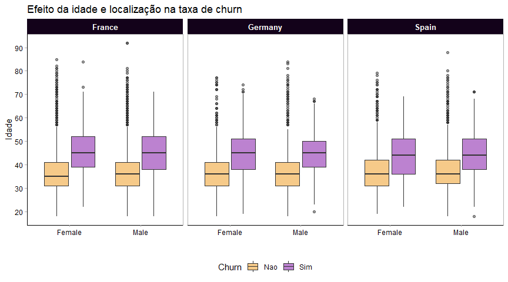
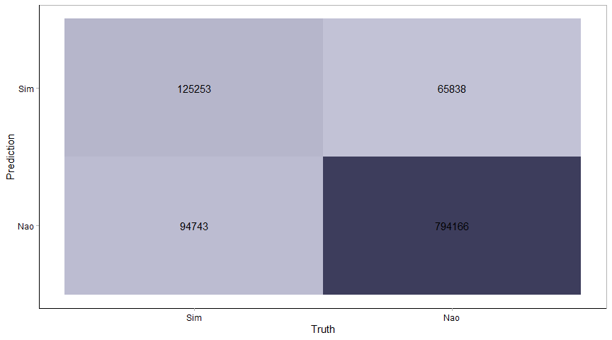

Churn Modelling
================
Rodrigo F. Pizzinato

-   [O problema de negócio](#o-problema-de-negócio)
    -   [O que é churn?](#o-que-é-churn)
-   [Carregamento dos dados](#carregamento-dos-dados)
-   [Análise Exploratória](#análise-exploratória)
-   [Modelagem](#modelagem)
    -   [Função para treinar algoritmos
        classificadores](#função-para-treinar-algoritmos-classificadores)
    -   [Separação dos dados de treino, teste e validação
        cruzada](#separação-dos-dados-de-treino-teste-e-validação-cruzada)
    -   [Preprocessamento](#preprocessamento)
    -   [Especificação do modelo](#especificação-do-modelo)
    -   [Balanceamento de classes](#balanceamento-de-classes)
-   [Matriz de confusão com dados
    balanceados](#matriz-de-confusão-com-dados-balanceados)
-   [Importância das variáveis](#importância-das-variáveis)

# O problema de negócio

## O que é churn?

No mundo atual é imprescidível que as empresas conheçam e tenha um bom
relacionamento com seus clientes. Para entender como se dá essa relação
com os clientes, o índice de churn é uma métrica muito utilizada, pois é
nela que se calcula a taxa de desistência de clientes num determinado
período.

Essa desistência pode acontecer por diversos motivos, como insatisfação
dos clientes com qualidade do produto, mau atendimento, ou até por
encontrar melhores empresas do mesmo ramo.

Desta forma, se torna essencial as empresas acompanharem esse
indicativo, visto que a perda de clientes impacta diretamente os
resultados financeiros da empresa e sua imagem no geral.

O objetivo deste projeto é utilizar técnicas de machine learning para
prever o churn de uma empresa e entender quais são as variáveis que mais
influenciam nisso.

# Carregamento dos dados

Os dados utilizados neste projeto foram baixados do
[Kaggle](https://www.kaggle.com/shubh0799/churn-modelling)

``` r
data <- read_csv("Dados/Churn_Modelling.csv")
glimpse(data)
```

    ## Rows: 10,000
    ## Columns: 14
    ## $ RowNumber       <dbl> 1, 2, 3, 4, 5, 6, 7, 8, 9, 10, 11, 12, 13, 14, 15, 16,~
    ## $ CustomerId      <dbl> 15634602, 15647311, 15619304, 15701354, 15737888, 1557~
    ## $ Surname         <chr> "Hargrave", "Hill", "Onio", "Boni", "Mitchell", "Chu",~
    ## $ CreditScore     <dbl> 619, 608, 502, 699, 850, 645, 822, 376, 501, 684, 528,~
    ## $ Geography       <chr> "France", "Spain", "France", "France", "Spain", "Spain~
    ## $ Gender          <chr> "Female", "Female", "Female", "Female", "Female", "Mal~
    ## $ Age             <dbl> 42, 41, 42, 39, 43, 44, 50, 29, 44, 27, 31, 24, 34, 25~
    ## $ Tenure          <dbl> 2, 1, 8, 1, 2, 8, 7, 4, 4, 2, 6, 3, 10, 5, 7, 3, 1, 9,~
    ## $ Balance         <dbl> 0.00, 83807.86, 159660.80, 0.00, 125510.82, 113755.78,~
    ## $ NumOfProducts   <dbl> 1, 1, 3, 2, 1, 2, 2, 4, 2, 1, 2, 2, 2, 2, 2, 2, 1, 2, ~
    ## $ HasCrCard       <dbl> 1, 0, 1, 0, 1, 1, 1, 1, 0, 1, 0, 1, 1, 0, 1, 0, 1, 1, ~
    ## $ IsActiveMember  <dbl> 1, 1, 0, 0, 1, 0, 1, 0, 1, 1, 0, 0, 0, 0, 1, 1, 0, 1, ~
    ## $ EstimatedSalary <dbl> 101348.88, 112542.58, 113931.57, 93826.63, 79084.10, 1~
    ## $ Exited          <dbl> 1, 0, 1, 0, 0, 1, 0, 1, 0, 0, 0, 0, 0, 0, 0, 0, 1, 0, ~

O conjunto de dados apresenta as seguintes colunas:

-   CustomerId: identificação do cliente;
-   Surname: sobrenome do cliente;
-   CreditScore: pontuação de credito do cliente;
-   Geography: país de onde o cliente pertence;
-   Gender: sexo do cliente;
-   Age: idade do cliente;
-   Tenure: tempo de que o cliente está com a empresa;
-   Balance: saldo da conta corrente;
-   NumOfProducts: número de produtos bancários adquiridos;
-   HasCrCard: se tem cartão de credito ou não;
-   IsActiveMember: se é um cliente com conta ativa;
-   EstimatedSalary: salário estimado do cliente;
-   Exited: se o cliente deixou de ser cliente do banco ou não.

Dado que **RowNumber** e **CustomerId** não apresenta informações úteis
para predição do Churn, elas serão removidas. As colunas **HasCrCard**,
**IsActiveMember**, e **Exited** estão codificadas com 0’s e 1’s e, no
código abaixo, foram traduzidas para *sim* e *não*.

``` r
data <- data %>% 
  dplyr::select(-RowNumber, -CustomerId, -Surname) %>% 
  mutate(across(c(HasCrCard, IsActiveMember, Exited), ~ if_else(.x == 1, "Sim", "Nao"))) %>% 
  janitor::clean_names()

#write_csv(x = data, "churn_processed.csv")
```

``` r
map_dfr(data, ~any(is.na(.x)))
```

    ## # A tibble: 1 x 11
    ##   credit_score geography gender age   tenure balance num_of_products has_cr_card
    ##   <lgl>        <lgl>     <lgl>  <lgl> <lgl>  <lgl>   <lgl>           <lgl>      
    ## 1 FALSE        FALSE     FALSE  FALSE FALSE  FALSE   FALSE           FALSE      
    ## # ... with 3 more variables: is_active_member <lgl>, estimated_salary <lgl>,
    ## #   exited <lgl>

Não há valores missing no conjunto de dados.

``` r
dim(data)
```

    ## [1] 10000    11

Existem 10000 clientes cadastrados na base e 12 características para
cada um deles.

# Análise Exploratória

``` r
# data %>% 
#   pivot_longer(-where(is.character)) %>%
#   select(exited, name, value) %>% 
#   ggplot(aes(value, fill = exited)) +
#   geom_density(alpha = 0.7, color = "black",
#                position = "identity", size = 1) +
#   facet_wrap(~name, scales = "free") +
#   scale_fill_manual(values = churn_colors) +
#   labs(x='', y='Densidade', fill = "Churn")

data %>% 
  pivot_longer(-where(is.character)) %>%
  select(exited, name, value) %>% 
  ggplot(aes(exited, value, fill = exited)) +
  geom_boxplot(alpha = 0.75) +
  stat_summary(geom = "point", fun = mean, size = 2, color = "dodgerblue") +
  scale_fill_manual(values = churn_colors) +
  facet_wrap(vars(name), scales = "free") +
  theme(legend.position = "top") 
```

<!-- -->

Ao analisar as variáveis numéricas pela categoria de **churn** é
possível entender alguns padrões:  
- clientes mais velhos costumam ter uma taxa churn maior.  
- existe um grande número de clientes que tem um saldo de conta
zerado.  
- número de produtos parece haver um grande concentração de clientes que
não deram churn e adquiriram 2 produtos.  
- as demais variáveis não demonstram ter grande efeito.

``` r
data %>% 
  count(exited) %>% 
  mutate(prop = n / sum(n)) %>% 
  ggplot(aes(exited, prop)) +
  geom_col(fill = "midnightblue", color = "black") +
  scale_y_continuous(labels = scales::percent) +
  geom_text(aes(label = paste0(prop*100,"%")),
            vjust = 1.5,
            size = 7, 
            color = "white") +
  labs(y='Proporção', x='Churn')
```

<!-- -->

A variável resposta **churn** está bem desbalanceada, o que pode nos
levar a necessidade de utilizar técnicas de balanceamento, que serão
vistas na etapa de feature engineering.

``` r
data %>% 
  ggplot(aes(gender, age, fill = exited)) +
  geom_boxplot(alpha = 0.5) +
  facet_wrap(~geography) + 
  scale_fill_manual(values = churn_colors) +
  scale_y_continuous(breaks = seq(10,100,10)) +
  theme(legend.position = "top") +
  labs(x='', y='Idade', 
       fill = "Churn")
```

<!-- -->

-   A variável idade apresenta outliers.
-   Parece que, invariavelmente, a idade tende a ser a característica
    mais importante para churn, dado que pessoas mais velhas apresentam
    uma taxa maior de churn, independentemente de país e gênero.

``` r
data %>%  
  count(num_of_products, exited) %>% 
  group_by(num_of_products) %>% 
  mutate(prop = (n / sum(n))*100) %>%
  ungroup() %>% 
  ggplot(aes(num_of_products, prop/100, fill = exited)) + 
  geom_col(color = "black") +
  geom_text(aes(label = paste0(round(prop,2), "%")),
            position = position_stack(vjust = .5), 
            color = "white", 
            size = 5) +
  scale_y_continuous(n.breaks = 7, labels = scales::percent_format(decimal.mark = ".")) +
  scale_fill_manual(values = churn_colors) +
  labs(x='', y='Proporção', fill = "Churn",
       title = 'Proporção de churn por quantidade de produtos') +
  theme(legend.position = "right")
```

<!-- -->

-   Os clientes que adquirem mais produtos tem uma tendência maior a
    realizar o churn.  
-   Os clientes que compraram 4 produtos, apesar de serem poucos (60
    para ser exato) em relação à base toda, realizaram churn.  
-   Isso demonstra talvez uma grande insatisfação pelos produtos, o que
    precisa ser revista pela empresa.

``` r
data %>% 
  select(exited, gender, has_cr_card, is_active_member) %>% 
  pivot_longer(gender:is_active_member, names_to = "variable", values_to = "value") %>% 
  ggplot(aes(value, fill = exited)) + 
  geom_bar(position = "fill", color = "black") +
  scale_fill_manual(values = churn_colors) +
  scale_y_continuous(labels = scales::percent) +
  facet_wrap(~variable, scales = "free", ncol = 1) +
  theme(legend.position = "top") +
  coord_flip() +
  labs(x='', y='', fill = "Churn")
```

<!-- -->

-   Ter ou não ter um cartão de crédito não é um indicativo importante
    de churn, porém ser um membro ativo, sim.  
-   Gênero também parece ser um bom indicativo de churn, dado que a
    mulheres costumam a sair mais do quadro de clientes.

``` r
data %>% 
  DataExplorer::dummify(maxcat = 10, select = names(data)[-1]) %>% 
  select(where(is.numeric)) %>% 
  cor() %>% 
  ggcorrplot(lab    = TRUE, 
             colors = c("#ed9613", "#fffaff", "#7a05a1"), 
             type   = "upper", 
             digits = 1)
```

<!-- -->

Parece não haver correlação muito alta entre as variáveis preditoras,
portanto não deve haver problemas de multicolinearidade nos modelos
estimados.

``` r
# Transformar variáveis strings em factor
data <- data %>% 
  mutate_if(is.character, factor) %>% 
  mutate(exited = fct_rev(exited))
```

# Modelagem

## Função para treinar algoritmos classificadores

``` r
train_classifiers <- function(rec, resamples, arrange_by = accuracy){
  
  glm_spec <- logistic_reg() %>% 
    set_mode("classification") %>% 
    set_engine("glm")
  
  naiveb_spec <- naive_Bayes() %>% 
    set_mode("classification") %>% 
    set_engine("klaR")
  
  knn_spec <- parsnip::nearest_neighbor() %>% 
    set_mode("classification") %>% 
    set_engine("kknn")
  
  dt_spec <- decision_tree() %>% 
    set_mode("classification") %>% 
    set_engine("rpart")
  
  mlp_spec <- parsnip::mlp() %>% 
    set_mode("classification") %>% 
    set_engine("nnet")
  
  lda_spec <- parsnip::discrim_linear() %>% 
    set_mode("classification") %>% 
    set_engine("MASS")
  
  svm_rbf_spec <- parsnip::svm_rbf() %>% 
    set_mode("classification") %>% 
    set_engine("kernlab")
  
  rf_spec <- parsnip::rand_forest() %>% 
    set_mode("classification") %>% 
    set_engine("ranger")
  
  xgb_spec <- parsnip::boost_tree() %>% 
    set_mode("classification") %>% 
    set_engine("xgboost")
  
  #lgbm_spec <- parsnip::boost_tree() %>% 
  #  set_mode("classification") %>% 
  #  set_engine("lightgbm")
  
  models = list(glm      = glm_spec,
                naiveb   = naiveb_spec,
                knn      = knn_spec,
                dt       = dt_spec,
                mlp      = mlp_spec,
                lda      = lda_spec,
                svm_rbf  = svm_rbf_spec,
                rf       = rf_spec,
                xgb      = xgb_spec)
  
  metrics <- metric_set(accuracy, roc_auc, recall, precision,
                        specificity, f_meas, mn_log_loss)
  
  wf_set <- workflow_set(preproc = list(recipe = rec), 
                         models  = models, 
                         cross   = TRUE)
  
  wf_rs <- workflowsets::workflow_map(object    = wf_set, 
                                      fn        = "fit_resamples",
                                      resamples = resamples,
                                      metrics   = metrics,
                                      seed      = 1234)
  
  results <- rank_results(wf_rs) %>%
    group_by(wflow_id, .metric) %>% 
    summarise(mean_of_model = mean(mean),
              .groups       = "drop") %>% 
    pivot_wider(id_cols     = "wflow_id", 
                names_from  = ".metric", 
                values_from = "mean_of_model") %>% 
    mutate(wflow_id = str_remove(wflow_id, "recipe_")) %>% 
    rename(model = wflow_id) %>% 
    arrange(desc({{arrange_by}})) 
  
  return(results)

}
```

Essa função é feita justamente para filtrar quais algoritmos terão maior
eficácia no conjunto de treino dos dados. Ela cria diversos algoritmos e
os treina em validação cruzada. Após isso, apresenta os resultado em um
tabela com diversas métricas de classificação.

## Separação dos dados de treino, teste e validação cruzada

``` r
# 80% para treino e 20% para teste. Estratificado pela variável resposta
# 3 folds para cross-validation
split <- initial_split(data, prop = 0.8, strata = exited)
folds <- vfold_cv(data, v = 3, strata = exited)

churn_train <- training(split)
churn_test <- testing(split)
```

## Preprocessamento

``` r
churn_rec <- recipe(exited ~ ., data = churn_train) %>% 
  step_YeoJohnson(all_numeric_predictors()) %>% 
  step_normalize(all_numeric_predictors()) %>% # normaliza os dados numericos
  step_dummy(all_nominal_predictors(), one_hot = TRUE) %>% # cria dummies de variaveis categoricas através de one hot encoding
  step_corr(all_numeric_predictors(), threshold = 0.8) %>% # retira variaveis com correlação > 0.8
  step_zv(all_predictors()) # retira variaveis com variância zero 
```

Nesta etapa, os dados são ajustado da forma correta para os modelos.
Portanto, a normalização das variáveis numéricas, criação de dummies
para variáveis categóricas, etc. são tarefas comumente utilizadas nesta
etapa. Neste caso, a criação de dummies foi feita antes do filtro de
variáveis correlacionadas, pois após o processo de criação de dummies,
as novas features podem assumir altas correlações entre si.

O dataset criado após esse processo é mostrado abaixo.

``` r
churn_rec %>% 
  prep() %>% 
  juice() 
```

    ## # A tibble: 7,999 x 13
    ##    credit_score    age tenure balance num_of_products estimated_salary exited
    ##           <dbl>  <dbl>  <dbl>   <dbl>           <dbl>            <dbl> <fct> 
    ##  1       -0.459  0.350 -1.45    0.629          -0.907         0.303    Nao   
    ##  2        0.483  0.159 -1.45   -1.33            0.802        -0.000719 Nao   
    ##  3        2.09   0.530 -1.03    0.777          -0.907        -0.252    Nao   
    ##  4        1.79   1.09   0.712  -1.33            0.802        -1.75     Nao   
    ##  5       -1.54   0.617 -0.280   0.824           0.802        -0.325    Nao   
    ##  6        0.326 -1.31  -1.03    0.803          -0.907        -0.383    Nao   
    ##  7       -1.27  -0.746  0.394   0.700           0.802        -0.233    Nao   
    ##  8       -1.58  -1.81  -0.642  -1.33            0.802        -0.300    Nao   
    ##  9       -1.79  -0.376  1.61   -1.33            0.802        -1.31     Nao   
    ## 10       -0.182 -0.262  0.712  -1.33            0.802        -0.488    Nao   
    ## # ... with 7,989 more rows, and 6 more variables: geography_France <dbl>,
    ## #   geography_Germany <dbl>, geography_Spain <dbl>, gender_Male <dbl>,
    ## #   has_cr_card_Sim <dbl>, is_active_member_Sim <dbl>

``` r
trained_models <- train_classifiers(rec        = churn_rec, 
                                    resamples  = folds, 
                                    arrange_by = f_meas)

p1 <- trained_models %>% 
  ggplot(aes(precision, recall)) +
  geom_point(pch = 21, fill = churn_colors[1], size = 10) +
  geom_text(aes(label = model), color = "black", hjust = 0.5, vjust = 0.1) +
  labs(title = 'Relação entre precision e recall dos modelos treinados.')

p2 <- trained_models %>% 
  ggplot(aes(fct_reorder(model,f_meas),f_meas)) + 
  geom_col(fill = churn_colors[2]) +
  geom_text(aes(label = round(f_meas,3)), 
            hjust = 1,
            color = "white", 
            size = 5) +
  scale_y_continuous(breaks = seq(0,0.7,0.1)) + 
  coord_flip() + 
  labs(x = "", y = "F1 Score", 
       title = "F1 Score dos modelos treinados") 

(p1 / p2)
```

<!-- -->

Como os dados estão desbalanceados, a acurácia não nos oferece um bom
indicativo de eficácia do modelo. Neste caso, o recall e precision serão
mais adequados.

Lembrando que a nossa classe positiva aqui é o churn.

O recall diz respeito a quantidade de dados classificados como positivos
que o algoritmo de fato detectou. Neste caso, o modelo XGBOOST detectou
quase 50%, segundo o primeiro gráfico. Já o precision indica quantos
realmente são positivos, do total que o modelo detectou como positivo. O
modelo XGBOOST oferece uma métrica de quase 80% aqui.

Considero as duas métricas igualmente importantes. Portanto, para este
projeto a métrica a ser otimizada será o F1-score, que basicamente é uma
média harmônica entre precision e recall, além de ser também muito útil
para caso de classes desbalanceadas.

O resultado encontrado de 0.5812 pode ser melhorado utilizando alguma
técnica de balanceamento e otimização de hiperparâmetros.

Isso será feito logo abaixo.

## Especificação do modelo

``` r
xgb_spec <- boost_tree(mtry = tune(),
                       trees = tune(),
                       min_n = tune(),
                       learn_rate = 0.02) %>% 
  set_engine("xgboost") %>% 
  set_mode("classification")

xgb_wf <- workflow(churn_rec, xgb_spec)
```

## Balanceamento de classes

Visto que os dados estão desbalanceados na variável resposta, será
utilizada uma técnica de balanceamento chamada ADASYN (Adaptive
Synthetic Sampling Method).

Esse algoritmo cria novas amostras de dados da classe minoritária
adicionando ruídos aleatórios às amostra existentes, evitando, desta
forma, que os novos dados criados tenham dependência linear.

O algoritmo também conta com alguns paramêtros para otimizar, como o
número de vizinho próximos considerados (`neighbors`) e valor da razão
entre a classe majoritária e minoritária (`over_ratio`).

Além desses parâmetros, deicidi também otimizar 3 hiperparâmetros do
classificador XGBoost. `mtry` é o número de preditores aleatoriamente
usados em cada árvore. `trees` representa o número de árvores que o
algoritmo utilizará e `min_n` é o tamanho mínimo de cada nó das árvores.

Foi criado, então, uma grade com todos esses parâmetros que foram
utilizados na etapa de cross-validation.

``` r
churn_rec_balanced <- churn_rec %>% 
  themis::step_adasyn(exited, neighbors = tune(), over_ratio = tune())

xgb_wf_balanced <- workflow(churn_rec_balanced, xgb_spec)

xgb_rs_balanced <- tune_grid(xgb_wf_balanced, 
                    folds, 
                    grid = crossing(mtry = c(3,4),
                                    trees = seq(400,800,200),
                                    min_n = seq(2,6,2),
                                    over_ratio = c(0.5, 0.75, 1),
                                    neighbors = c(2,3)),
                    metrics = metric_set(roc_auc, f_meas),
                    control = control_grid(save_pred = TRUE))
```

``` r
xgb_rs_balanced %>% 
  show_best("f_meas") %>% 
  select(mtry:neighbors, `F1-Score` = mean) %>% 
  knitr::kable(digits = 3,  
               caption = "Melhores parâmetros para F1-Score")
```

| mtry | trees | min\_n | over\_ratio | neighbors | F1-Score |
|-----:|------:|-------:|------------:|----------:|---------:|
|    3 |   400 |      4 |         0.5 |         3 |    0.615 |
|    3 |   600 |      4 |         0.5 |         3 |    0.615 |
|    3 |   800 |      4 |         0.5 |         3 |    0.615 |
|    3 |   400 |      6 |         0.5 |         3 |    0.613 |
|    3 |   600 |      6 |         0.5 |         3 |    0.613 |

Melhores parâmetros para F1-Score

# Matriz de confusão com dados balanceados

``` r
xgb_rs_balanced %>% 
  collect_predictions() %>% 
  conf_mat(exited, .pred_class) %>% 
  ggplot2::autoplot(type = "heatmap") +
  ggplot2::scale_fill_viridis_c(option = "E")
```

<!-- -->

``` r
xgb_rs_balanced %>% 
  collect_predictions() %>% 
  mutate(exited = fct_rev(exited)) %>% 
  ggplot(aes(.pred_Sim, fill = exited)) + 
  geom_density(alpha = 0.75, size = 1) + 
  scale_fill_manual(values = churn_colors)
```

<!-- -->

# Importância das variáveis

``` r
xgb_last_fit <- xgb_wf_balanced %>% 
  finalize_workflow(select_best(xgb_rs_balanced, metric = "f_meas")) %>% 
  last_fit(split)

xgb_last_fit %>% 
  extract_workflow() %>% 
  extract_fit_parsnip() %>% 
  vip::vip(aes = list(fill = "midnightblue")) 
```

<!-- -->

``` r
xgb_last_fit %>% 
  extract_workflow() %>% 
  extract_fit_parsnip() %>%
  vip::vi() %>% 
  mutate(Variable = str_replace_all(Variable, "_", "-") %>% str_to_title(),
         Variable = fct_reorder(Variable, Importance)) %>% 
  ggplot(aes(Importance, Variable)) +
  ggalt::geom_lollipop(point.colour = churn_colors[2], point.size = 7,
                       size = 1, horizontal = TRUE)
```

<!-- -->

Como esperado, a idade demonstrou ser a variável mais importante para
predição do churn. Logo em seguida vem o número de produtos adquiridos
pelo cliente e os clientes que são ativos.
