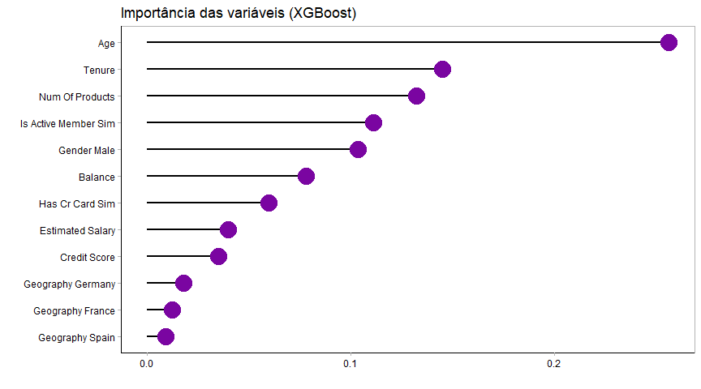

<!-- README.md is generated from README.Rmd. Please edit that file -->

```{r, include = FALSE}
knitr::opts_chunk$set(
  collapse = TRUE,
  comment = "#>"
)
```

# Análise de churn 
## Objetivo do projeto 
A identificação de clientes que possam se desligar capacidade essencial para qualuer empresa atualmente.  
Neste projeto pretendo explorar um conjunto de dados de clientes de uma empresa e tentar prever o probabilidade de churn através
de técnicas de machine learning.  

-  Para visualizar o projeto: [clique aqui](https://github.com/RodrigoFP51/Analise_churn/blob/master/Churn.md)  

## Dados
Dados utilizados: [Kaggle](https://www.kaggle.com/shubh0799/churn-modelling)  

-   CustomerId: identificação do cliente;
-   Surname: sobrenome do cliente;
-   CreditScore: pontuação de credito do cliente;
-   Geography: país de onde o cliente pertence;
-   Gender: sexo do cliente;
-   Age: idade do cliente;
-   Tenure: tempo de que o cliente está com a empresa;
-   Balance: saldo da conta corrente;
-   NumOfProducts: número de produtos bancários adquiridos;
-   HasCrCard: se tem cartão de credito ou não;
-   IsActiveMember: se é um cliente com conta ativa;
-   EstimatedSalary: salário estimado do cliente;
-   Exited: se o cliente deixou de ser cliente do banco ou não;    

## Tecnologias
-  RStudio
-  Tidyverse (ggplot2, dplyr, tidyr, forcats...)
-  Tidymodels (parsnip, tune, workflow...)
-  Vip
-  Themis

## Modelos

-  Depois de testados diversos modelos de machine learning através do método de validação cruzada, chegou-se a conclusão de que o melhor modelo é um extreme gradient boosting (XGBoost).  

## Resultados

-  O modelo XGBoost atingiu um F1-Score de 0.61 e acurácia de 0.84.  
-  A escolha das métricas foram justificadas no projeto.  

## Conclusão
-  É possível chegar em resultados melhores talvez pelo uso de diferentes método de feature engineering, ou de algoritmos de deep learning, porém as variáveis mais importantes para o modelo dificilmente serão diferente das encontradas aqui.  
-  


